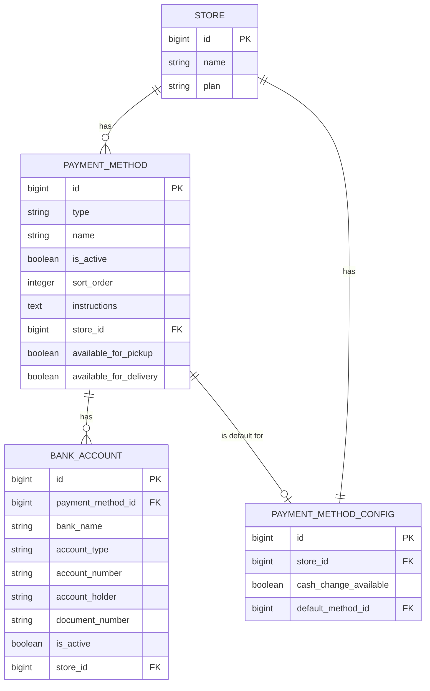
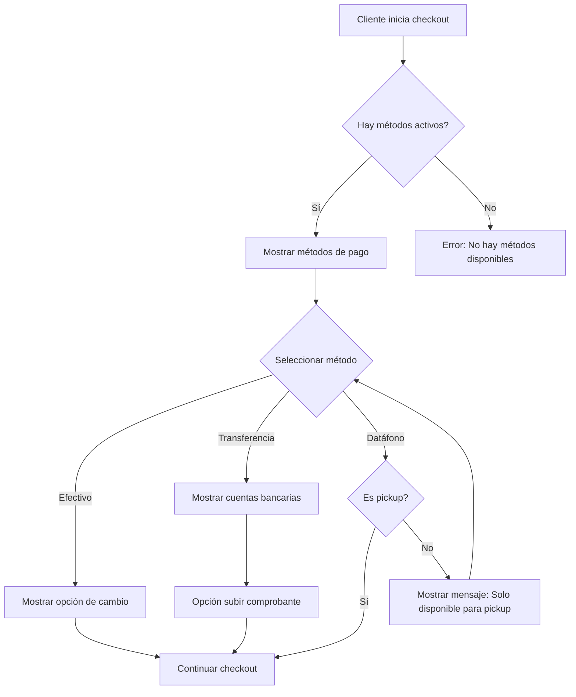
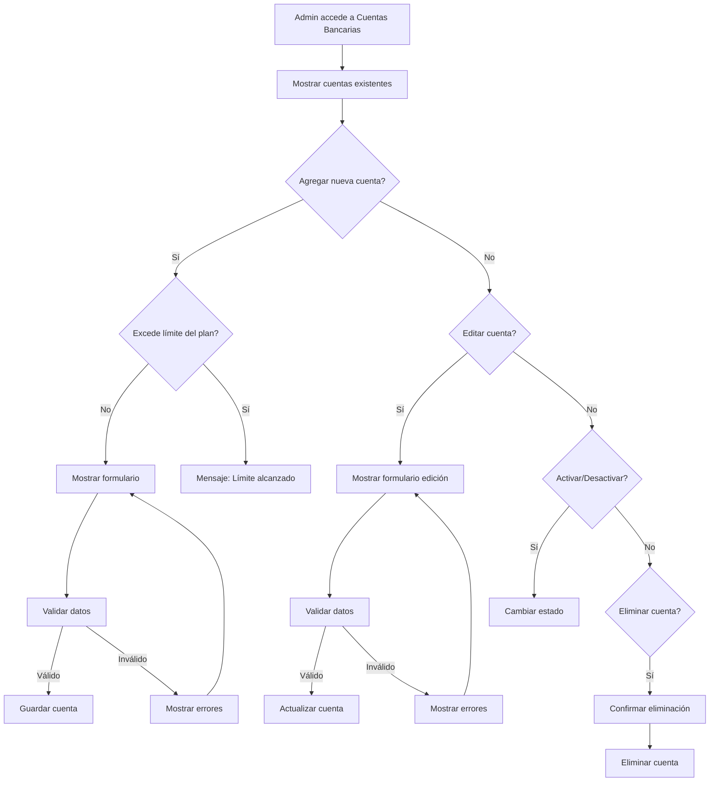

# Diseño de Métodos de Pago

## Visión General

Este documento describe el diseño técnico para la implementación de la funcionalidad de Métodos de Pago en el sistema. La funcionalidad permitirá a los administradores de tiendas configurar diferentes métodos de pago (Efectivo, Transferencia Bancaria y Datáfono) con opciones personalizadas, respetando los límites establecidos según el plan de suscripción del usuario.

## Arquitectura

La funcionalidad de Métodos de Pago seguirá el patrón MVC (Modelo-Vista-Controlador) y se integrará dentro de la estructura de Features existente en la aplicación. Se implementará como parte del módulo TenantAdmin, similar a la funcionalidad de Ubicaciones ya implementada.

### Componentes Principales:

1. **Modelos**: Representan las entidades de datos (PaymentMethod, BankAccount, PaymentMethodConfig)
2. **Controladores**: Manejan las solicitudes HTTP y la lógica de negocio (PaymentMethodController)
3. **Vistas**: Interfaces de usuario para administradores y clientes
4. **Servicios**: Lógica de negocio reutilizable (PaymentMethodService)
5. **Políticas**: Control de acceso basado en planes de suscripción (PaymentMethodPolicy)

## Componentes e Interfaces

### 1. Controladores

#### PaymentMethodController

Responsable de gestionar las operaciones CRUD para los métodos de pago.

```php
namespace App\Features\TenantAdmin\Controllers;

class PaymentMethodController extends Controller
{
    public function index();        // Mostrar todos los métodos de pago
    public function create();       // Formulario para crear método
    public function store();        // Guardar nuevo método
    public function show($id);      // Ver detalles de un método
    public function edit($id);      // Formulario para editar método
    public function update($id);    // Actualizar método existente
    public function destroy($id);   // Eliminar método
    public function updateOrder();  // Actualizar orden de métodos (drag & drop)
    public function toggleActive($id); // Activar/desactivar método
}
```

#### BankAccountController

Responsable de gestionar las operaciones CRUD para las cuentas bancarias.

```php
namespace App\Features\TenantAdmin\Controllers;

class BankAccountController extends Controller
{
    public function index();        // Mostrar todas las cuentas bancarias
    public function create();       // Formulario para crear cuenta
    public function store();        // Guardar nueva cuenta
    public function edit($id);      // Formulario para editar cuenta
    public function update($id);    // Actualizar cuenta existente
    public function destroy($id);   // Eliminar cuenta
    public function toggleActive($id); // Activar/desactivar cuenta
}
```

### 2. Servicios

#### PaymentMethodService

Encapsula la lógica de negocio relacionada con los métodos de pago.

```php
namespace App\Features\TenantAdmin\Services;

class PaymentMethodService
{
    public function getAvailableMethods($store);  // Obtener métodos disponibles para una tienda
    public function validateMethodLimits($store); // Validar límites según plan
    public function getDefaultMethod($store);     // Obtener método por defecto
    public function ensureActiveMethod($store);   // Asegurar que haya al menos un método activo
    public function updateMethodOrder($methods);  // Actualizar orden de métodos
}
```

#### BankAccountService

Encapsula la lógica de negocio relacionada con las cuentas bancarias.

```php
namespace App\Features\TenantAdmin\Services;

class BankAccountService
{
    public function getActiveBankAccounts($store);  // Obtener cuentas activas
    public function validateBankAccountLimits($store); // Validar límites según plan
    public function getBankAccountLimit($store);    // Obtener límite según plan
    public function handlePlanDowngrade($store);    // Manejar bajada de plan
}
```

### 3. Políticas

#### PaymentMethodPolicy

Controla el acceso y límites según el plan de suscripción.

```php
namespace App\Features\TenantAdmin\Policies;

class PaymentMethodPolicy
{
    public function viewAny($user);         // Ver listado de métodos
    public function create($user);          // Crear nuevo método
    public function update($user, $method); // Actualizar método
    public function delete($user, $method); // Eliminar método
}
```

#### BankAccountPolicy

Controla el acceso y límites para cuentas bancarias según el plan.

```php
namespace App\Features\TenantAdmin\Policies;

class BankAccountPolicy
{
    public function viewAny($user);           // Ver listado de cuentas
    public function create($user);            // Crear nueva cuenta
    public function update($user, $account);  // Actualizar cuenta
    public function delete($user, $account);  // Eliminar cuenta
    public function exceedsLimit($user);      // Verificar si excede límite del plan
}
```

## Modelos de Datos

### Estructura de Tablas

#### payment_methods

| Campo | Tipo | Descripción |
|-------|------|-------------|
| id | bigint | Identificador único (PK) |
| type | string | Tipo de método (efectivo, transferencia, datáfono) |
| name | string | Nombre del método |
| is_active | boolean | Estado activo/inactivo |
| sort_order | integer | Orden de visualización |
| instructions | text | Instrucciones para el cliente (opcional) |
| store_id | bigint | ID de la tienda (FK) |
| available_for_pickup | boolean | Disponible para recogida en tienda |
| available_for_delivery | boolean | Disponible para entrega a domicilio |
| created_at | timestamp | Fecha de creación |
| updated_at | timestamp | Fecha de actualización |

#### bank_accounts

| Campo | Tipo | Descripción |
|-------|------|-------------|
| id | bigint | Identificador único (PK) |
| payment_method_id | bigint | ID del método de pago (FK) |
| bank_name | string | Nombre del banco |
| account_type | string | Tipo de cuenta (ahorros, corriente) |
| account_number | string | Número de cuenta |
| account_holder | string | Titular de la cuenta |
| document_number | string | Número de documento del titular (opcional) |
| is_active | boolean | Estado activo/inactivo |
| store_id | bigint | ID de la tienda (FK) |
| created_at | timestamp | Fecha de creación |
| updated_at | timestamp | Fecha de actualización |

#### payment_method_config

| Campo | Tipo | Descripción |
|-------|------|-------------|
| id | bigint | Identificador único (PK) |
| store_id | bigint | ID de la tienda (FK) |
| cash_change_available | boolean | Disponibilidad de cambio para efectivo |
| default_method_id | bigint | ID del método de pago por defecto (FK) |
| created_at | timestamp | Fecha de creación |
| updated_at | timestamp | Fecha de actualización |

### Relaciones

1. **PaymentMethod** tiene una relación uno a muchos con **BankAccount**
2. **Store** tiene una relación uno a muchos con **PaymentMethod**
3. **Store** tiene una relación uno a uno con **PaymentMethodConfig**
4. **PaymentMethod** tiene una relación uno a uno con **PaymentMethodConfig** (a través de default_method_id)

### Modelos Eloquent

#### PaymentMethod

```php
namespace App\Features\TenantAdmin\Models;

use Illuminate\Database\Eloquent\Model;

class PaymentMethod extends Model
{
    protected $fillable = [
        'type', 'name', 'is_active', 'sort_order', 'instructions', 
        'store_id', 'available_for_pickup', 'available_for_delivery'
    ];

    protected $casts = [
        'is_active' => 'boolean',
        'available_for_pickup' => 'boolean',
        'available_for_delivery' => 'boolean',
    ];

    public function store()
    {
        return $this->belongsTo(Store::class);
    }

    public function bankAccounts()
    {
        return $this->hasMany(BankAccount::class);
    }
}
```

#### BankAccount

```php
namespace App\Features\TenantAdmin\Models;

use Illuminate\Database\Eloquent\Model;

class BankAccount extends Model
{
    protected $fillable = [
        'payment_method_id', 'bank_name', 'account_type', 'account_number',
        'account_holder', 'document_number', 'is_active', 'store_id'
    ];

    protected $casts = [
        'is_active' => 'boolean',
    ];

    public function paymentMethod()
    {
        return $this->belongsTo(PaymentMethod::class);
    }

    public function store()
    {
        return $this->belongsTo(Store::class);
    }
}
```

#### PaymentMethodConfig

```php
namespace App\Features\TenantAdmin\Models;

use Illuminate\Database\Eloquent\Model;

class PaymentMethodConfig extends Model
{
    protected $fillable = [
        'store_id', 'cash_change_available', 'default_method_id'
    ];

    protected $casts = [
        'cash_change_available' => 'boolean',
    ];

    public function store()
    {
        return $this->belongsTo(Store::class);
    }

    public function defaultMethod()
    {
        return $this->belongsTo(PaymentMethod::class, 'default_method_id');
    }
}
```

## Manejo de Errores

1. **Validación de Límites de Plan**:
   - Se mostrará un mensaje de error cuando se intente agregar más cuentas bancarias de las permitidas por el plan.
   - Se desactivará el botón "Agregar Cuenta" cuando se alcance el límite.

2. **Validación de Métodos Activos**:
   - Se impedirá desactivar todos los métodos de pago, mostrando un mensaje de error.
   - Se mantendrá al menos un método activo automáticamente.

3. **Validación de Datos**:
   - Se validará el formato del número de cuenta (solo números, 10-20 dígitos).
   - Se validará que los campos obligatorios estén completos.

4. **Manejo de Bajada de Plan**:
   - Se inactivarán automáticamente las cuentas bancarias excedentes.
   - Se mostrará un mensaje informativo al usuario.

## Estrategia de Pruebas

### Pruebas Unitarias

1. **Modelos**:
   - Pruebas de relaciones entre modelos
   - Pruebas de atributos y castings

2. **Servicios**:
   - Pruebas de validación de límites según plan
   - Pruebas de manejo de bajada de plan
   - Pruebas de actualización de orden de métodos

### Pruebas de Integración

1. **Controladores**:
   - Pruebas de operaciones CRUD para métodos de pago
   - Pruebas de operaciones CRUD para cuentas bancarias
   - Pruebas de actualización de orden (drag & drop)

2. **Políticas**:
   - Pruebas de límites según plan de suscripción
   - Pruebas de permisos de acceso

### Pruebas de Interfaz

1. **Vistas de Administrador**:
   - Pruebas de drag & drop para ordenar métodos
   - Pruebas de activación/desactivación de métodos
   - Pruebas de formularios de creación/edición

2. **Vistas de Cliente (Checkout)**:
   - Pruebas de selección de métodos de pago
   - Pruebas de opciones específicas por método (cambio para efectivo, subida de comprobante para transferencia)

## Diagramas

### Diagrama de Relaciones de Entidades



### Diagrama de Flujo - Proceso de Checkout



### Diagrama de Flujo - Gestión de Cuentas Bancarias

